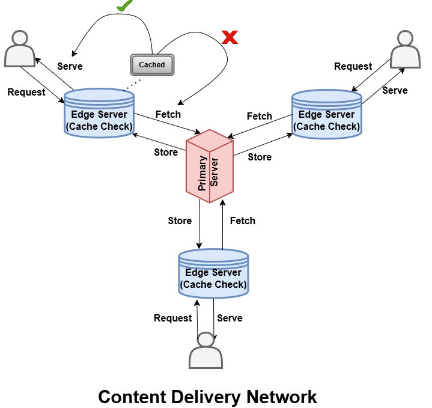
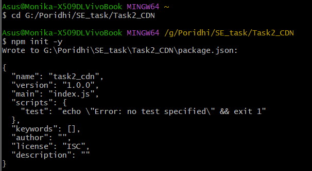
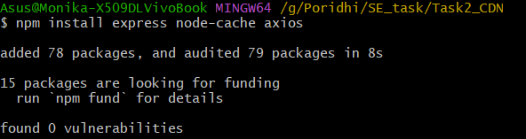
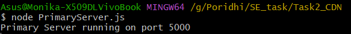
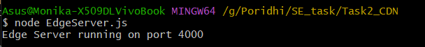
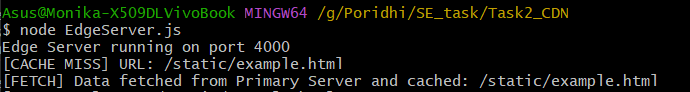
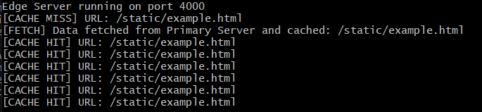
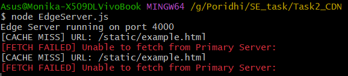

# 📌 Mini CDN Simulation in Node.js
This project demonstrates a simple Content Delivery Network (CDN) simulation using Node.js, where static files (images, CSS, JS etc) are served from a Primary Server and cached (use 'node-cached' for caching) at an Edge Server for performance optimization.

## 🔹 Architecture




### **📝 CDN Workflow Summary:**  

**1️⃣ Client (User):** Requests a static file from the Edge Server.  
**2️⃣ Edge Server (Cache Layer):**  
✅ **Cache Hit:** Serves file from cache (`node-cache`).  
❌ **Cache Miss:** Fetches from Primary Server, caches it, then serves to the user.  
**3️⃣ Primary Server (Main Storage):** Provides static files only when requested by the Edge Server (on cache miss).  


## 🔹 Project Components
✅ **Node.js & Express.js:** For building the servers.  
✅ **node-cache:** For caching mechanisms.  
✅ **Static Files:** HTML for demonstration.

## 🔹 Required Tools:
- **Git Bash** (Make sure it is installed)
- **Node.js** (Check using: `node -v`)
- **npm** (Check using: `npm -v`)

## 🛠️ Steps to Build the Project
### 1. **Go to the Project Folder and Initialize a Node.js Project:**
```bash
cd G:/Poridhi/SE_task/Task2_CDN
npm init -y
```


### 3. **Install Dependencies:**
```bash
npm install express node-cache axios
```

### 4. **Create Files:**
- `PrimaryServer.js`
- `EdgeServer.js`
- `Public/example.html`

### 5. **Run the Servers:**
#### Start the Primary Server:
```bash
node PrimaryServer.js
```

#### Start the Edge Server:
```bash
node EdgeServer.js
```

### 🌐 **Test in Browser:**
Visit: [http://localhost:4000/static/example.html](http://localhost:4000/static/example.html)

## 🔹 **Console Output Explanation:**

🚀 **Cache Miss:** Fetched from the Primary Server and stored in the cache.


🚀 **Cache Hit:** Served directly from the cache.



🚀 **Primary Server Down:** Displays a fetch failed error.


Now, the mini project Content Delivery Network is done.